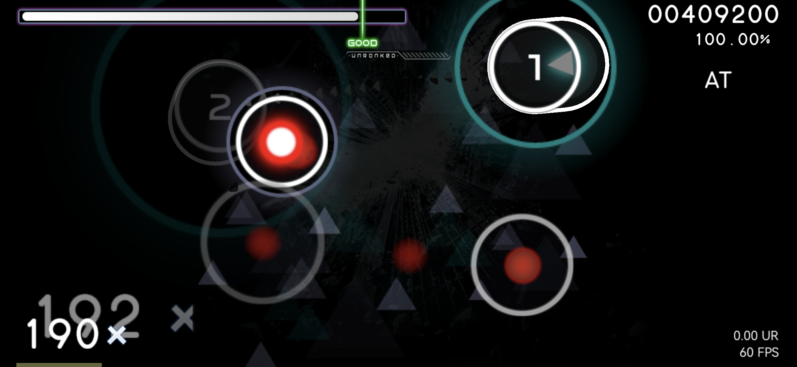
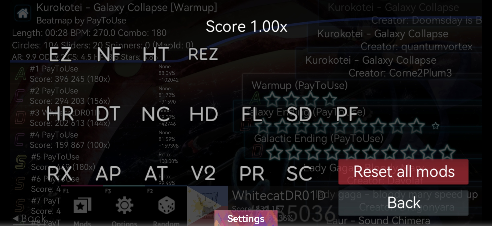
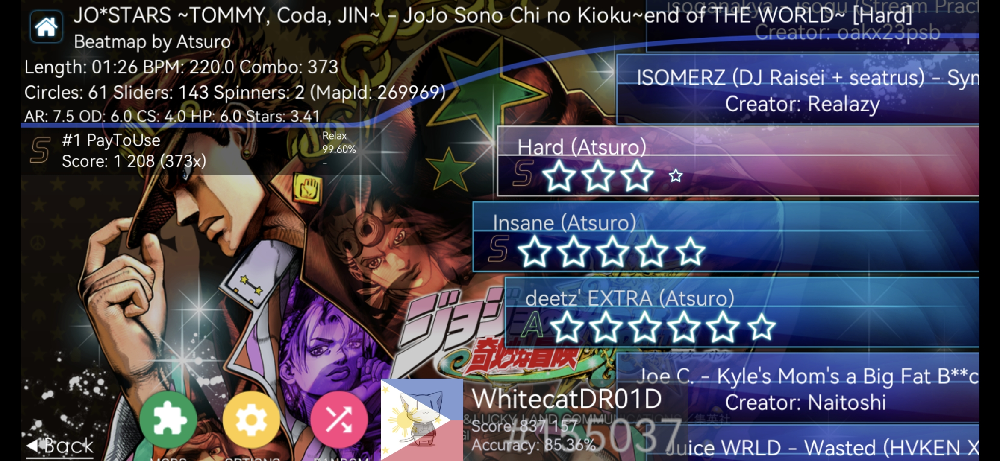
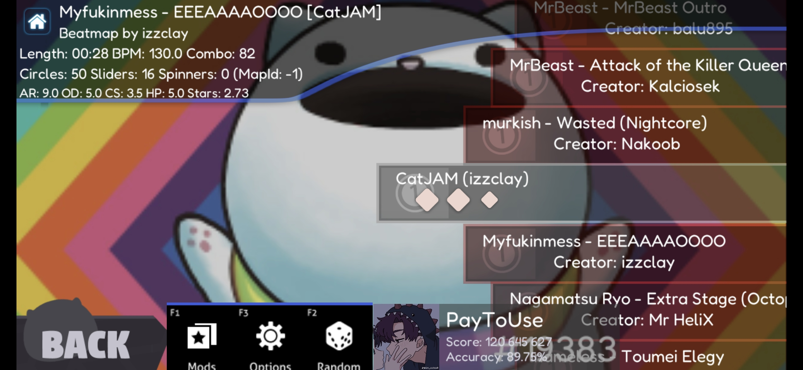
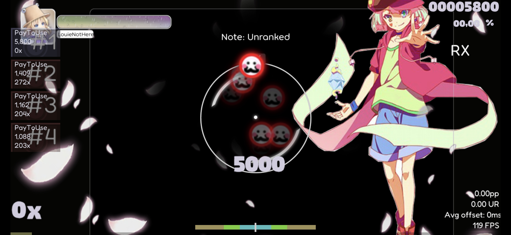
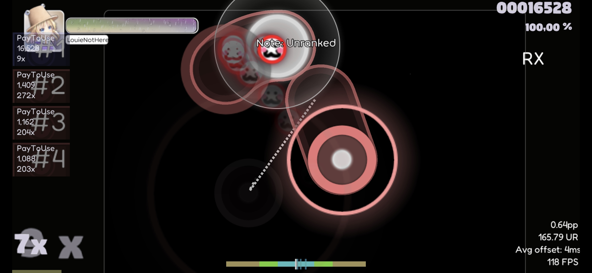

## 《PTU》Cracked Ruby
My own custom osu!standard skin for supported osu! clients.

Cracked ruby has it's own customizable assets in the `other-assets`folder so users can customize the skin as their own edited skin. But since this skin is in-development, the author of the skin (me) will try to add more assets for the `other-assets` folder in the skin's directory.

You may customize the combo color of the `skin.ini` file but before you edit the skin, put this one as an edit:

```
<osu! username> Edit
```

## v1.0 Screenshots and Previews
Some preview screenshots are from users, credits to them below the screenshots

osu!lazer preview:

</img>

osu!droid preview:

</img>
</img>
</img>

# v1.3 Screenshots and Previews

osu!droid preview:

</img>
</img>

Mods preview:

</img>

New UI preview:

</img>

opsu! preview:

</img>

# v1.5 Screenshots and Previews

osu!droid preview:

</img>
</img>
</img>


# User screenshots
 
All of the screenshots sent by users go here, if you wish to send me some, dm me on discord: LouieNotHere#2336

## Supported clients

| Client | Support | Date Checked |
| ------------ | ------------ | ------------ |
| osu! | ✅ | 04-11-2023 |
| osu!lazer (**official osu! alternate**) | ✅ | 04-11-2023 |
| osu!droid | ✅ | 02-13-2023 |
| McOsu | Not checked yet | ??-??-???? |
| opsu! | ✅ | 02-28-2023 |
| Other osu!clients | Not checked yet | ??-??-???? |

## Development Status
Last updated: Tuesday, February 28, 2023

Latest Version: v1.5-beta (*overhauling the gameplay and the menu assets, release soon*) 

I thinked of a new idea about overhauling most assets in game from the skin, which means *almost* everything will change except for the cursor, but the `other-assets` folder will contain new and added assets (not replaced lmao)

## Note
Please note that editing the skin is allowed, but please put "*Cracked Ruby* `(<USERNAME> Edit)`" if you want to publish it to the public, and most assets we're credited to a bunch of skins dedicated to players who currently use it.

## Cloning
Copy this command and paste it into your terminal, *make sure you have the git package installed*

```
git clone https://github.com/PayToUse/cracked-ruby
```

To install the git package before you do the command, copy this and paste it to your terminal, *and wait some time*

```
pkg install git
```

While waiting for the download to finish, there's a popup that `lets the terminal use enough space for the package`. You must type `y` and press the `Enter` key and wait for it to finish downloading the package. (*Termux only, sorta.*)
