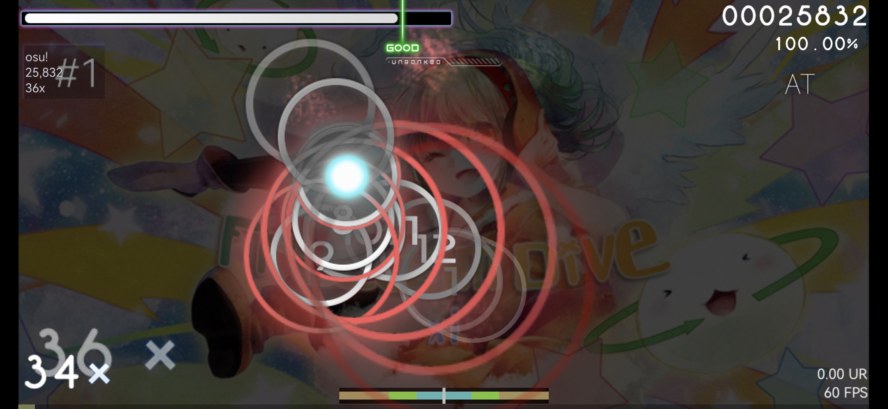
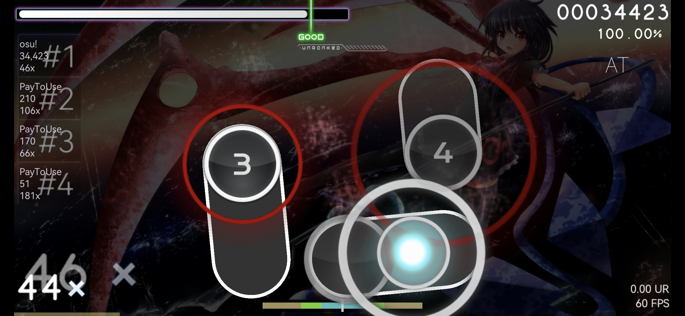

## 《PTU》Cracked Ruby
My own custom osu!standard skin.

## Screenshots
osu!lazer preview:

</img>

osu!droid preview:

</img>
</img>
</img>

opsu! preview:

</img>

All of the screenshots, if you wish to send me some, dm me on discord: LouieNotHere#2336

## Supported clients

| Client | Support |
| ------------ | ------------ |
| osu! | ✅ |
| osu!lazer (**official osu! alternate**) | ✅ |
| osu!droid | ✅ |
| McOsu | Not Checked Yet |
| opsu! | ✅ |
| Other osu!clients | Not checked |

## Development Status
Last updated: Friday, February 24, 2023

Latest Version: v1.2.2 (beta) (*in development, currently working on the changes to the source code*) 

## Note
idk why all of a sudden the name of the skin file included the 《CK》symbol, but it wasn't official made by cyperdark.

## Cloning
Copy this command and paste it into your terminal, *make sure you have the git package installed*
```
git clone https://github.com/PayToUse/cracked-ruby
```

To install the git package before you do the command, copy this and paste it to your terminal, *and wait some time*
```
pkg install git
```
